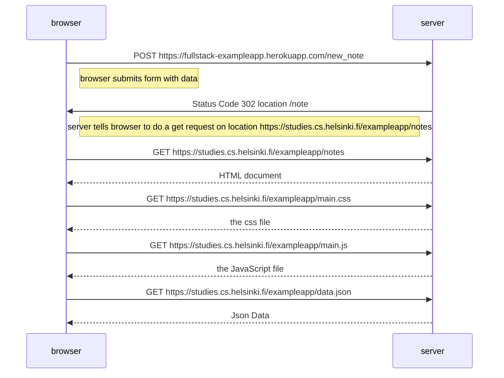

```mermaid
sequenceDiagram
    participant browser
    participant server

    browser->>server: POST https://fullstack-exampleapp.herokuapp.com/new_note
    Note right of browser: browser submits form with data
    server->>browser: Status Code 302 location /note
    
    Note left of server: server tells browser to do a get request on location https://studies.cs.helsinki.fi/exampleapp/notes
    
    browser->>server: GET https://studies.cs.helsinki.fi/exampleapp/notes
    server-->>browser: HTML document
    browser->>server: GET https://studies.cs.helsinki.fi/exampleapp/main.css
    server-->>browser: the css file
    browser->>server: GET https://studies.cs.helsinki.fi/exampleapp/main.js
    server-->>browser: the JavaScript file
    browser->>server: GET https://studies.cs.helsinki.fi/exampleapp/data.json
    server-->>browser: Json Data
```